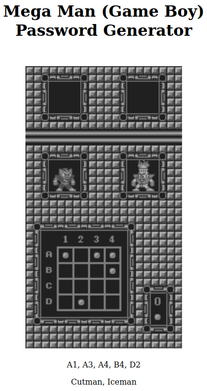

# Mega Man ● Dr. Wily's Revenge ● Game Boy

[Check it out](https://bugtamer.github.io/gb-megaman/)

- See [Megaman 2](https://github.com/bugtamer/megaman2) (NES) Password generator

## Passwords

| Elec | Cut | Ice | Fire | Zero-based Index | Coordinates        |
|:----:|:---:|:---:|:----:|:----------------:|:------------------:|
| -    | -   | -   | -    | 2, 4,  6,  9, 11 | A3, B1, B3, C2, C4 |
| ●    | -   | -   | -    | 1, 3,  6, 12, 13 | A2, A4, B3, D1, D2 |
| -    | ●   | -   | -    | 3, 6, 11, 14, 15 | A4, B3, C4, D3, D4 |
| -    | -   | ●   | -    | 0, 1,  5,  6, 15 | A1, A2, B2, B3, D4 |
| -    | -   | -   | ●    | 0, 4,  5  11, 13 | A1, B1, B2, C4, D2 |
| ●    | ●   | -   | -    | 0, 2,  4,  6, 14 | A1, A3, B1, B3, D3 |
| -    | ●   | ●   | -    | 0, 2,  3,  7, 13 | A1, A3, A4, B4, D2 |
| -    | -   | ●   | ●    | 1, 6, 13, 14, 15 | A2, B3, D2, D3, D4 |
| ●    | -   | ●   | -    | 0, 7,  8, 13, 15 | A1, B4, C1, D2, D4 |
| -    | ●   | -   | ●    | 1, 5, 10, 12, 14 | A2, B2, C3, D1, D3 |
| ●    | -   | -   | ●    | 5, 7,  8, 10, 11 | B2, B4, C1, C3, C4 |
| -    | ●   | ●   | ●    | 0, 1,  6, 11, 15 | A1, A2, B3, C4, D4 |
| ●    | -   | ●   | ●    | 1, 2,  8, 13, 14 | A2, A3, C1, D2, D3 |
| ●    | ●   | -   | ●    | 2, 5,  6,  7, 11 | A3, B2, B3, B4, C4 |
| ●    | ●   | ●   | -    | 0, 2,  8, 11, 14 | A1, A3, C1, C4, D3 |
| ●    | ●   | ●   | ●    | 1, 2,  7,  9, 10 | A2, A3, B4, C2, C3 |

# Resources

- The Mega Man Home Page. [MEGA MAN I (GB) PASSWORD GENERATOR](http://www.mmhp.net/Passwords/MMI/). (2023-01-28).
